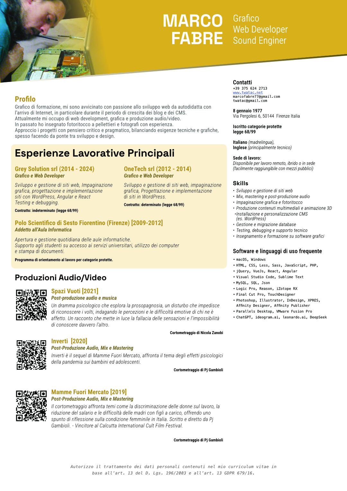
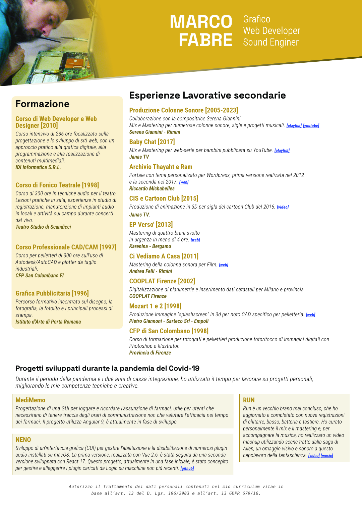

# Marco Fabre

**Nascita**: 8 Gennaio 1977  
**Indirizzo**: Via Pergolesi 6, Firenze, 50144 Italia  
**Legge 68/99**: Iscritto categorie protette  
**Email**: marcofabre77@gmail.com | twatac@gmail.com

**Lingue**: Italiano (madrelingua), Inglese (principalmente tecnico)

**Sede di lavoro**: Da remoto, ibrido e/o facilmente raggiungibile con mezzi pubblici

---

# Profilo

_Professionista con esperienza in web development, grafica, produzione Grafico di formazione, mi sono avvicinato con passione allo sviluppo web da autodidatta con
l’arrivo di Internet, in particolare durante il periodo di crescita dei blog e dei CMS.
Attualmente mi occupo di web development, grafica e produzione audio/video.
In passato ho insegnato fotoritocco a pellettieri e fotografi con esperienza.
Approccio i progetti con pensiero critico e pragmatico, bilanciando esigenze tecniche e grafiche, spesso facendo da ponte tra sviluppo e design._

---

# Esperienze Lavorative Principali

## Grey Solution srl (2014 - 2024)

_Grafico e Web Developer_

Sviluppo e gestione di siti web, Impaginazione
grafica, progettazione e implementazione
siti con WordPress, Angular e React
Testing e debugging.

**Contratto: indeterminato (legge 68/99)**

## OneTech srl (2012 - 2014)

_Grafico e Web Developer_

Sviluppo e gestione di siti web, impaginazione
grafica, Progettazione e implementazione
di siti in WordPress.

**Contratto: determinato (legge 68/99)**

## TinextCyber [2025]

_Grafico multimediale_

Collaborazione su progetti grafici interni, impaginazione di presentazioni aziendali e realizzazione di brevi contenuti video.
Attività svolta da remoto in coordinamento con
il team grafico e IT. [Alfa Romeo](https://youtu.be/ZVYBhs0oWUw?si=S6HzWIl7PJU0XaXr) [Tinexta Cyber](https://youtu.be/ZVYBhs0oWUw?si=S6HzWIl7PJU0XaXr)

**Contratto: determinato (legge 68/99)**

## Polo Scientifico di Sesto Fiorentino (Firenze) [2009-2012]

_Addetto all’Aula Informatica_

Apertura e gestione quotidiana delle aule informatiche.
Supporto agli studenti su accesso ai servizi universitari, utilizzo dei computer
e stampa di documenti.

**Programma di orientamento al lavoro per categorie protette.**

---

# Produzioni Audio/Video

## Spazi Vuoti [2021]

_Post-produzione audio e musica_

Un dramma psicologico che esplora la prosopagnosia, un disturbo che impedisce
di riconoscere i volti, indagando le percezioni e le difficoltà emotive di chi ne è
affetto. Un racconto che mette in luce la fallacia delle sensazioni e l’impossibilità
di conoscere davvero l’altro.

**Cortometraggio di Nicola Zanobi** | [Home Page](https://www.esenstudios.com/film/spazi-vuoti)

## Inverti [2020]

_Post-Produzione Audio, Mix e Mastering_

Inverti è il sequel di Mamme Fuori Mercato, affronta il tema degli effetti psicologici
della pandemia sui bambini ed adolescenti.

**Cortometraggio di Pj Gambioli** | [Trailer](https://youtu.be/4RwESEPQXio?si=RA0VlfZeDubqmA_5#inverti)

## Mamme Fuori Mercato [2019]

Post-Produzione Audio, Mix e Mastering
Il cortometraggio affronta temi come la discriminazione delle donne sul lavoro, la
riduzione del salario e le difficoltà delle madri con figli a carico, offrendo uno
spunto di riflessione sulla condizione femminile in Italia. Scritto e diretto da Pj
Gambioli. - Vincitore al Calcutta International Cult Film Festival.

**Cortometraggio di Pj Gambioli** | [Trailer](https://youtu.be/M0wNTksceaU?si=2vRXkpIo32DYExdY#mfm)

---

# Formazione

## Formazione generale e specifica per lavoratori d’ufficio [2025]

Corso di sicurezza sul lavoro che integra la formazione generale e specifica per lavoratori d’ufficio, con focus su prevenzione dei rischi, sicurezza, stress lavoro-correlato e uso corretto delle attrezzature.
Gruppo Erepi

## Corso di Web Developer e Web Designer [2010]

Corso intensivo di 236 ore focalizzato sulla progettazione e lo sviluppo di siti web, con un approccio pratico alla grafica digitale, alla programmazione e alla realizzazione di contenuti multimediali.

_IDI Informatica S.R.L._

### Corso di Fonico Teatrale [1998]

Corso di 300 ore in tecniche audio per il teatro. Lezioni pratiche in sala, esperienze in studio di registrazione, manutenzione di impianti audio in locali e attività sul campo durante concerti dal vivo.

_Teatro Studio di Scandicci_

### Corso Professionale CAD/CAM [1997]

Corso per pelletteri di 300 ore sull’uso di Autodesk/AutoCAD e plotter da taglio industriali.

_CFP San Colombano FI ì_

### Grafica Pubblicitaria [1996]

Percorso formativo incentrato sul disegno, la fotografia, la fotolito e i principali processi di stampa.

_Istituto d’Arte di Porta Romana_

---

# Esperienze Lavorative secondarie

### Produzione Colonne Sonore [2005-2023]

Collaborazione con la compositrice Serena Giannini.
Mix e Mastering per numerose colonne sonore, sigle e progetti musicali. | [playlist](https://www.youtube.com/playlist?list=PLgHw223qd7DU7vAK-FKFA0bR19MlP7Uqv#sgpl) | [youtube](https://www.youtube.com/@SerenaGiannini)

**Serena Giannini - Rimini**

### Baby Chat [2017]

Mix e Mastering per web-serie per bambini pubblicata su YouTube. | [playlist](https://www.youtube.com/playlist?list=PLT-LY8Qjh8Da0kfvMAqiSmExMd9XY8G1n#bebychat)

**Janas TV**

### Archivio Thayaht e Ram

Portale con tema personalizato per Wordpress, prima versione realizata nel 2012
e la seconda nel 2017. | [home page](https://www.thayaht-ram.com/wp/)

**Riccardo Michahelles**

### CIS e Cartoon Club [2015]

Produzione di animazione in 3D per sigla del cartoon Club del 2016. | [video](https://youtu.be/3ZctuZF5fdE?si=12gL4BXrFW-tXGUW)

**Janas TV**

### EP Verso' [2013]

Mastering di quattro brani svolto
in urgenza in meno di 4 ore. | [web](https://spaziorock.it/archivio/recensione.php?&id=karenina_verso_2013)

**Karenina - Bergamo**

### Ci Vediamo A Casa [2011]

Mastering della colonna sonora per Film. | [web](https://www.cinemaitaliano.info/news/15902/ci-vediamo-a-casa-le-musiche-di-andrea-felli.html)

**Andrea Felli - Rimini**

### COOPLAT Firenze [2002]

Digitalizzazione di planimetrie e inserimento dati catastali per Milano e provincia

**COOPLAT Firenze**

### Mozart 1 e 2 [1998]

Produzione immagine "splashscreen" in 3d per noto CAD specifico per pelletteria. | [web](https://www.allegromaestoso.com/index.htm)

**Pietro Giannoni - Sarteco Srl - Empoli**

### CFP di San Colombano [1998]

Corso di formazione per fotografi e pellettieri produzione fotoritocco di immagini digitali con Photoshop e Illustrator.

**Provincia di Firenze**

---

## Progetti sviluppati durante la pandemia del Covid-19

_Durante il periodo della pandemia e i due anni di cassa integrazione, ho utilizzato il tempo per lavorare su progetti personali, migliorando le mie competenze tecniche e creative._

### MediMemo

Progettazione di una GUI per loggare e ricordare l'assunzione di farmaci, utile per utenti che necessitano di tenere traccia degli orari di somministrazione non che valutare l’efficacia nel tempo dei farmaci. Il progetto utilizza Angular 9, è attualmente in fase di sviluppo.

### NENO

Sviluppo di un'interfaccia grafica (GUI) per gestire l'abilitazione e la disabilitazione di numerosi plugin audio installati su macOS. La prima versione, realizzata con Vue 2.6, è stata seguita da una seconda versione sviluppata con React 17. Questo progetto, attualmente in una fase iniziale, è stato concepito per gestire e alleggerire i plugin caricati da Logic su macchine non più recenti. | [github](https://github.com/morpe/Neno)

### RUN

Run è un vecchio brano mai concluso, che ho aggiornato e completato con nuove registrazioni di chitarre, basso, batteria e tastiere. Ho curato personalmente il mix e il mastering e, per accompagnare la musica, ho realizzato un video mashup utilizzando scene tratte dalla saga di Alien, un omaggio visivo e sonoro a questo capolavoro della fantascienza. | [video](https://youtu.be/oVA3c7hXZWw?si=8ix9eDEWuZmJ8EVW#video) | [music](https://www.youtube.com/watch?v=qQRjoNsdTa8#music)

---

### Skills

-   Sviluppo e gestione di siti web
-   Mix, mastering e post-produzione audio
-   Impaginazione grafica e fotoritocco
-   Produzione contenuti multimediali e animazione 3D
-   Installazione e personalizzazione CMS (es. WordPress)
-   Gestione e migrazione database
-   Testing, debugging e supporto tecnico
-   Insegnamento e formazione su software grafici

### Software e linguaggi di uso frequente

-   macOS, Windows
-   HTML, CSS, Less, Sass, JavaScript, PHP,
-   jQuery, VueJs, React, Angular
-   Visual Studio Code, Sublime Text
-   MySQL, SQL, Json
-   Logic Pro, Reason, iZotope RX
-   Final Cut Pro, TouchDesigner
-   Photoshop, Illustrator, InDesign, XPRES, Affinity Designer, Affinity Publisher
-   Parallels Desktop, VMware Fusion Pro
-   ChatGPT, ideogram.ai, leonardo.ai, DeepSeek

---

_Autorizzo il trattamento dei dati personali contenuti nel mio curriculum vitae in base all'art. 13 del D. Lgs. 196/2003 e all'art. 13 GDPR 679/16._

**Ultima modifica**: 21 luglio 2025

# anteprima PDF

